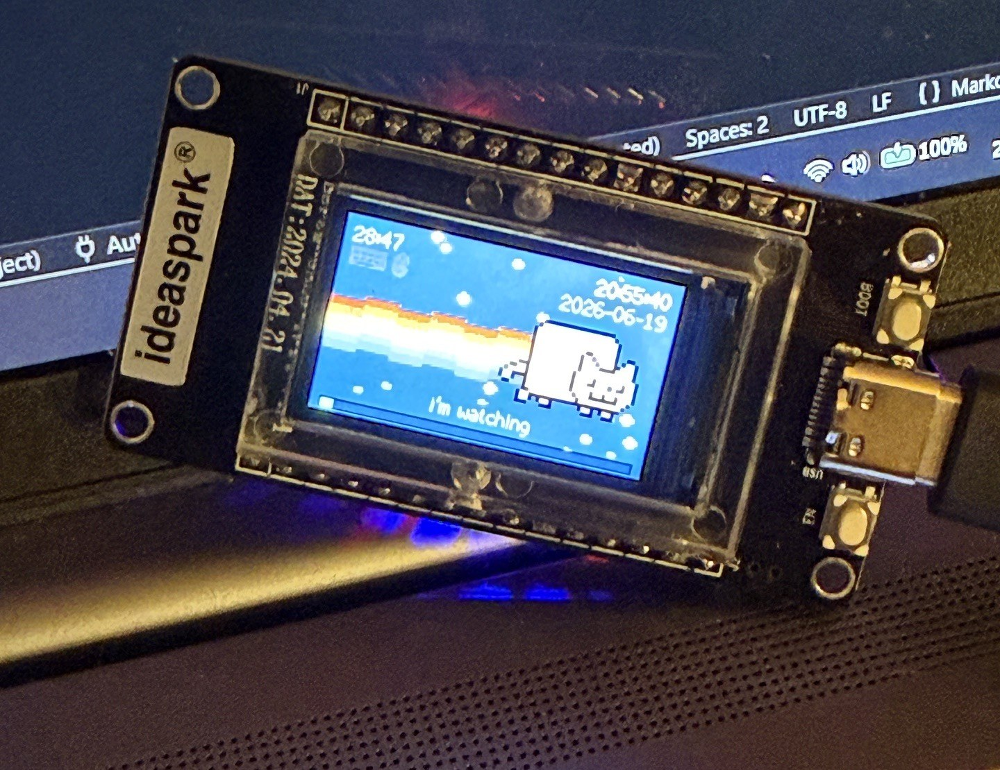
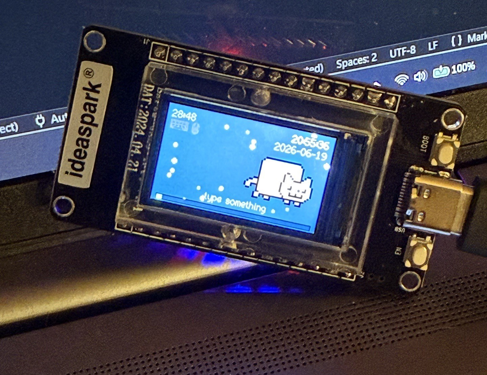

# Desk Cat - a sassy break-reminder companion (ideaspark ESP32)

A tiny cat that lives on your desk and judges your work habits. It's happy
while you're using the computer, gets sleepy when you wander off, and demands a
5-minute break after every 30 minutes of real input time.

Runs on the ideaspark ESP32 (ESP32-WROOM-32 + 1.14" ST7789 240x135 color TFT).
No WiFi, no cloud, no accounts. Everything runs locally over the USB cable that
already powers the board.

## See it in action
<p align="center">
  
  &nbsp;
  
</p>

## Hardware

Just the one board — no extra components, wiring, or soldering:

- **[ideaspark ESP32 dev board](https://www.amazon.com/dp/B0D7S7YQMC)** — ESP32-WROOM-32 with a built-in 1.14" ST7789 240×135 color TFT, CH340 USB-C, and an onboard BOOT button. This is the only part you need to buy.
- A **USB-C data cable** (not charge-only) — powers the board and carries the activity/time data to and from your computer.
- A computer running the helper — **Windows, macOS, or Linux**.

## How it works

```text
 keyboard/mouse -> PC helper (Python) -> USB serial -> ESP32 cat
                  "idle=<seconds> k=<0/1> m=<0/1> t=<timestamp>"
```

- `pc_helper/cat_companion.py` reads system idle time and streams it to the
  board about 6 times per second.
- `src/main.cpp` turns that one idle number into moods, the 30/5 break timer,
  the bottom work status bar, and the animation.
- The 30:00 work countdown only advances while keyboard or mouse input happened
  recently (`WORK_IDLE_SECONDS`, default 5 seconds).
- The cat considers you truly away after `IDLE_AWAY_SECONDS` (default 30
  seconds), which is when sleepy mode kicks in (Nyan stops, the rainbow
  disappears, and it naps and drifts lazily through space).
- The bottom status bar fills green across the 30-minute work window. After 30
  minutes it stays full and shifts green -> yellow -> orange -> red. At 35
  minutes it pulses until you press BOOT.
- Press the ESP32 BOOT button **anytime** to start a 5-minute break early (for
  when you just need to stop) — or to acknowledge the break when it's due. Press
  it again during a break to end it early. When a break finishes, the next
  keyboard/mouse input starts a fresh work session.

## Moods

| State | When | Cat |
|-------|------|-----|
| Active | you're present at the computer | happy Nyan Cat |
| Sleepy | idle ~30s+ | slow stars, "zzz" |
| Break due | 30 min of real input time | asks for BOOT |
| Grumpy | you keep working past 35 min | pulsing red bar |
| On break | BOOT was pressed | counts down 5:00 |

## Run it

1. Flash the firmware: open this folder in VS Code with PlatformIO and click
   Upload, or run `pio run -t upload`.
2. Start the helper: see [pc_helper/README.md](pc_helper/README.md):
   `pip install pyserial` then `python pc_helper/cat_companion.py`.

## Display config

The ST7789 pins are baked into `platformio.ini` `build_flags` (this board looks
like a TTGO T-Display but the pins differ): MOSI 23, SCLK 18, CS 15, DC 2,
RST 4, backlight 32.

## Testing The Break Loop Fast

Don't want to wait 30 minutes? Add to `build_flags` in `platformio.ini`:

```ini
-DWORK_SECONDS=60 -DBREAK_SECONDS=15
```

You can also tune the idle behavior:

```ini
-DWORK_IDLE_SECONDS=3 -DIDLE_AWAY_SECONDS=20
```

The serial test commands are gated behind a build flag. Add `-DDEBUG_SERIAL=1`,
then with the serial monitor open (helper stopped) type `break` to trigger a
break prompt, `boot` to simulate the button, or `reset` to clear the work timer.

Standalone wall-clock Pomodoro mode is opt-in:

```ini
-DENABLE_STANDALONE=1
```
